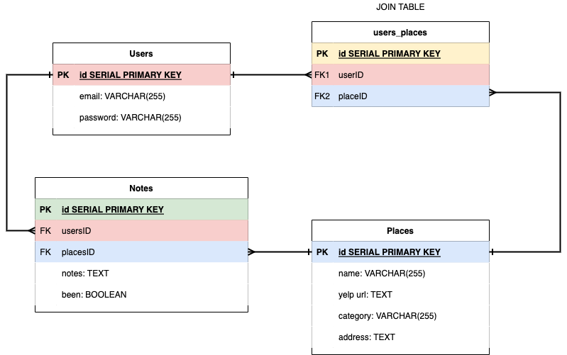

# The Travel Buddy

## Deployed Link
https://the-travel-buddy-1.herokuapp.com/
___
## About
The Travel Buddy is meant to help make it easier to plan out your travel plans (or your every day adventures).

It's an app with the ability to search for places to go and add it to a personalized to-do list that you can check off. 
___

## The Story Behind The App
When I make plans to go travel somewhere, I find that I use various apps to search for places I want to go, things I want to see, restaurants I want to eat at, etc.

Each time I identify a place I'm interested in, I find myself using the Notes app on my phone to type out the place to visit and save it for later. Then I switch back to the search/travel apps to continue looking.

I also have experiences where I go to a restaurant and I order something delicious and I think to myself, "I'm going to have to order this again the next time I back". However, when the next time comes around, I don't even remember what it was I ordered and that's what I get for trying to trust my memory.

The Travel Buddy is my attempt to trim the information and functionality packed features from other travel and search applications and combine it with a to-do list like system to provide an app that completes just 3 primary functions.
1. Search for places to go
2. Add to lists of places to go / places you've been
3. Make notes/comments
___

## User Stories
- As a user, I want to be able to create a personalized account so that I can track/save my lists
- As a user, I want to be able to add to/remove from a list of "Places"
- As a user, I want to be able to add "Notes" on to those saved "Places"
___

## Routing Chart
| Method | Path | Purpose |
| ------ | ---- | ------- |
| GET | / | Home / login page
| POST | / | Log in to user from home page
| GET | /new | Page to create a new user
| POST | /new | Adds new user created to database
| GET | /user | User's main page with a search bar displayed
| GET | /user/profile | User's profile page
| PUT | /user/profile | Edit user's information
| GET | /results | A page with the generated list from the user's search
| GET | /logout | User is logged out / cookies removed / and then redirected to home page
| GET | /places | Page with list of user's saved places to go
| POST | /places | Add the selected place to the user's saved places list/page
| DELETE | /places | Deletes a previously added location from the user's saved list
| GET | /notes | Page with list of user's saved notes
| POST | /notes | Adds a "note" to one of the saved "places"
| DELETE | /notes | Delete a created note
| GET | /about | An about page
___
## ERDs

___

## Wireframes

___
## Final Product Images

___
## Tech Utilized
- HTML
- CSS
- JavaScript
- Bootstrap
- PostgreSQL
- Node.js
- Express
- Sequelize
___

## MVP Checklist
- [X] All links/nav bar work appropriately to navigate from one page to another
- [X] Logging in will allow you to save to a list of "Places" and add "notes"
- [X] Completing a search for a place to go will accurately redirect/return to a page with results
- [X] Deleting from a list will accurately remove the location from the appropriate database
- [X] Users have the ability to attach notes/comments to the locations they've saved/added
- [X] Users have the ability to edit their profiles
___

## Stetch Goals
- [X] Make the page responsive for smaller screen devices
- [ ] Add functionality to organize notes / filter
- [ ] Implement a map API
- [ ] Create a social page to share thoughts/ideas/opinions/reviews about visited locations
___

## Code Highlights
```javascript
'use strict';
const yelp = require('yelp-fusion');
const apiKey = process.env.YELP_API_KEY

app.get('/results', async (req, res) => {
    if (req.cookies.userId) {
        try {
            const searchedTerm = await req.query.term
            const searchedLocation = await req.query.location
            const searchRequest = {
                term: searchedTerm,
                location: searchedLocation,
            };    
            const client = yelp.client(apiKey);
            const response = await client.search(searchRequest)
            res.render('results/results.ejs', {response})
        } catch(err) {
            console.log(err)
        }
    }
})
```
```javascript
router.post('/', async (req, res) => {
    console.log(req.body)
    try {
        const [place, placeCreated] = await db.place.findOrCreate({
            where: {
                name: req.body.name,
                yelpUrl: req.body.yelpUrl,
                category: req.body.category,
            }
        })   
        const user = await db.user.findOne({
            where: {
                id: res.locals.currentUser.id
            }
        })
    await place.addUser(user)
    } catch (error) {
        console.log(error)
    }
})
```
___

## Resources
- https://www.yelp.com/developers/documentation/v3/get_started
- https://github.com/Yelp/yelp-fusion#code-samples
- https://github.com/tonybadguy/yelp-fusion
- https://getbootstrap.com/
- https://bootswatch.com/lux/
- https://fontawesome.com/docs/web/
- https://www.heroku.com/
